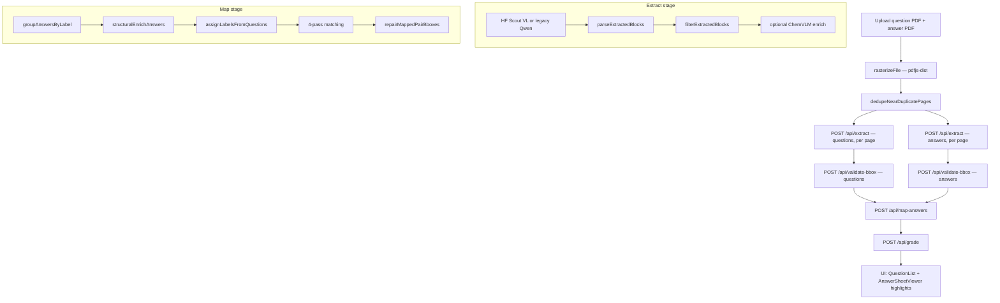

# GradeSight — Methods, Flow, Models & Implementation

This document describes how the exam grading pipeline works: which models are used, the end-to-end flow, core methods, and where each piece is implemented in the codebase.

---

## 1. Overview

GradeSight is a **Next.js 16** app that:

1. Rasterizes a **question paper** and **handwritten answer sheet** (PDF or image)
2. **Extracts** structured question/answer blocks with vision-language models
3. **Validates** bounding boxes for UI highlighting
4. **Maps** answers to questions (label + semantic + topic heuristics)
5. **Grades** matched pairs with an LLM
6. **Highlights** the answer region when a question is selected

The design is **paper-agnostic**: logic is driven by visible labels, question content, and topic keywords — not hardcoded question numbers from a specific exam.

---

## 2. Models & Services

| Role | Model / Service | Provider | Env vars | When used |
|------|-----------------|----------|----------|-----------|
| **Primary extract** | `meta-llama/Llama-4-Scout-17B-16E-Instruct:novita` | Hugging Face Inference Providers | `HF_TOKEN`, `HF_QWEN_MODEL` | Default prod + dev |
| **Bbox repair / localize** | Same Scout VL model | HF Inference | `HF_TOKEN` | `/api/validate-bbox`, post-map repair |
| **Extract supplement** | Same Scout VL (2nd pass per answer page) | HF Inference | `HF_TOKEN`, `EXTRACT_SUPPLEMENT≠0` | Short missed answers on answer sheets |
| **Grading + feedback** | `openai/gpt-oss-20b` (default) | Groq API | `GROQ_API_KEY`, `GROQ_MODEL` | `/api/grade` |
| **Chemistry specialist** | `AI4Chem/ChemVLM-8B` | Local FastAPI (`ml/serve_chem.py`) | `USE_CHEM_VLM=1`, `CHEM_VLM_URL` | Optional local GPU only |
| **Legacy local extract** | `Qwen/Qwen2.5-VL-3B-Instruct` (+ optional LoRA) | Local FastAPI (`ml/serve_extract.py`) | `USE_LEGACY_LOCAL_EXTRACT=1`, `LOCAL_EXTRACT_URL` | Offline dev fallback |

### Matching embeddings

Pass 2 mapping uses **lexical bag-of-words vectors** (`lib/lexicalEmbed.ts`) — no external embedding API. Cosine similarity threshold: **0.72** (`SEMANTIC_MATCH_THRESHOLD`).

### Vercel / production

- **Use:** `HF_TOKEN`, `GROQ_API_KEY`
- **Do not use:** `USE_CHEM_VLM`, `USE_LEGACY_LOCAL_EXTRACT`, local Python URLs

---

## 3. End-to-End Flow



### Client orchestration

All stages are driven from `app/page.tsx`:

| Step | UI stage | API / lib |
|------|----------|-----------|
| Rasterize | `uploading` | `lib/pdf-rasterize.ts`, `lib/dedupePages.ts` |
| Extract Q + A | `extracting` | `POST /api/extract` (one page per request) |
| Validate bbox | `validating` | `POST /api/validate-bbox` (per page) |
| Map | `mapping` | `POST /api/map-answers` |
| Grade | `grading` | `POST /api/grade` |
| Results | `done` | `MappingScreen` + `AnswerSheetViewer` |

---

## 4. Stage 1 — Extract

### Entry points

| File | Function | Description |
|------|----------|-------------|
| `app/api/extract/route.ts` | `POST` | HTTP handler |
| `lib/extract.ts` | `extractDocument()` | Routes HF vs legacy local |
| `lib/hf-qwen.ts` | `extractDocument()`, `extractPageWithQwen()` | Default HF VL extract |
| `lib/local-extract.ts` | `extractDocumentLocal()` | Legacy Python client |
| `ml/serve_extract.py` | `POST /extract` | Local Qwen server |

### Method

1. Send full-page PNG + `EXTRACT_PROMPT` (`lib/extractPrompt.ts`) to the VL model
2. Model returns a JSON array of blocks per page
3. `lib/parseExtract.ts` → `parseExtractedBlocks()` normalizes labels, bboxes, `contentKind`
4. `lib/filterExamBlocks.ts` → `filterExtractedBlocks()` removes boilerplate (questions) and noise (answers); groups answers by label at extract time is **not** done here (only at map)
5. Optional **supplement pass** (`supplementPageShortAnswers`) on answer pages for labels missed on first pass
6. Optional **ChemVLM pass** (`lib/chem-vlm.ts` → `enrichChemistryBlocks()`) for chemistry diagram/formula blocks

### Output schema — `ExtractedBlock`

Defined in `lib/types.ts`:

```typescript
{
  id, pageIndex, text,
  labelNumber?, labelWritten?,
  bbox?: { x, y, w, h },   // normalized 0–1, top-left origin
  bboxSource: 'qwen' | 'gemini' | 'none',
  contentKind?: 'text' | 'numerical' | 'formula' | 'derivative' | 'diagram' | 'table' | 'mixed',
  mathLatex?, diagramDescription?, tableData?,
  continuesFrom?, isStrikethrough?, extraPages?
}
```

### ChemVLM specialist (optional)

```
General VL extract → filter
        ↓
If contentKind ∈ {diagram, formula, mixed} AND chemistry topic detected
        ↓
Crop bbox → ChemVLM → refine mathLatex + diagramDescription
```

| File | Role |
|------|------|
| `lib/chem-vlm.ts` | Block selection, HTTP client |
| `ml/serve_chem.py` | FastAPI, `POST /enrich`, PIL crop + ChemVLM pipeline |
| `lib/contentTopics.ts` | `CHEMISTRY_TOPICS`: methanal, sodium, periodic, drycell |

Start locally: `USE_CHEM_VLM=1` + `npm run dev` (starts Next.js + ChemVLM via `scripts/dev.ts`).

---

## 5. Stage 2 — Validate Bbox

| File | Function | Description |
|------|----------|-------------|
| `app/api/validate-bbox/route.ts` | `POST` | HTTP handler |
| `lib/bboxCheck.ts` | `partitionByBbox()`, `coerceBbox()` | Split valid vs missing boxes |
| `lib/hf-qwen.ts` | `repairBlocksWithHf()`, `localizeBboxWithHf()` | HF vision re-localize by text |

### Method

1. Blocks with valid bboxes pass through unchanged
2. Blocks missing/invalid bboxes → second VL call: “find region containing this answer text”
3. Returns JSON `{ x, y, w, h }` normalized to page
4. On HF **402 / credits exhausted**, repair aborts; extract bboxes are kept as-is

### Bbox utilities (highlight quality)

| File | Functions |
|------|-----------|
| `lib/bboxRepair.ts` | `padBbox()`, `sliceBboxByTextRange()`, `repairMappedPairBboxes()` |
| `components/AnswerSheetViewer.tsx` | Renders overlays with `padBbox()` for display |

Post-map repair re-localizes bboxes for split-derived blocks (`-inline-`, `-short-`, etc.) when HF credits are available.

---

## 6. Stage 3 — Map Answers

| File | Function |
|------|----------|
| `app/api/map-answers/route.ts` | `POST` — calls `mapAnswersToQuestions()` + `repairMappedPairBboxes()` |
| `lib/matching.ts` | `mapAnswersToQuestions()` — 4-pass matcher |
| `lib/groupAnswers.ts` | `groupAnswersByLabel()` — merge consecutive lines under last label |
| `lib/enrichAnswers.ts` | Structural splits + question-driven label assignment |
| `lib/questionIndex.ts` | `buildQuestionIndex()`, `assignLabelsFromQuestions()`, `answerQuestionFit()` |
| `lib/contentTopics.ts` | Topic rules for rematch / conflict filtering |
| `lib/validateExtract.ts` | Cross-check answer labels vs question paper |

### Pre-match enrichment pipeline

```
raw answers
  → groupAnswersByLabel()          // merge lines; spatially separate blocks stay split
  → structuralEnrichAnswers()        // split glued mega-blocks
  → assignLabelsFromQuestions()      // question-driven label repair
  → validateAnswerLabels()           // clear orphan labels
  → preferLeafBlocks()               // drop parent duplicates when children exist
```

### Structural enrich methods (`lib/enrichAnswers.ts`)

| Function | Purpose |
|----------|---------|
| `splitInlineLabeledAnswerBlocks()` | Split on inline `4)`, `5(a)`, `9.` labels (incl. diagramDescription) |
| `splitEmbeddedShortLines()` | Peel short GK answers (e.g. “mercury”, “Ambedkar”) from glued blocks |
| `splitMergedTopicBlocks()` | Split photosynthesis + Newton + dry cell in one block |
| `splitTrianglePlantBlocks()` | Split triangle area + plant cell |
| `splitProfitTriangleBlocks()` | Split profit calc + triangle |
| `splitPhotoPlantBlocks()` | Split photosynthesis + plant cell diagram metadata |
| `expandParentAnswerLabels()` | Expand `5` → `5(a)` / `5(b)` from visible sub-parts |
| `dedupeSameLabelRichBlocks()` | Keep richest diagram when duplicates share a label |

### Four-pass matching (`lib/matching.ts`)

| Pass | Method | Criteria |
|------|--------|----------|
| **1** | Exact label | `normalizeLabel()` match Q ↔ A; prefer richer diagram on tie |
| **2** | Cosine similarity | Lexical embed ≥ 0.72; skip topical conflicts |
| **3** | Topic keywords | `topicalOverlap()` on `STRONG_TOPICS` |
| **4** | Orphan rematch | `answerQuestionFit()` for short unlabeled answers |

Unmatched questions → `unanswered`. Unmatched answers → `unmatched_answer`.

### Label normalization

| File | Functions |
|------|-----------|
| `lib/normalizeLabel.ts` | `normalizeLabel()`, `formatLabel()`, `parseNormalizedLabel()` |
| `lib/findLabel.ts` | `findLabelAnywhere()` — detect Q4, 5(a), 10. in text |

Examples: `11 (a)` → `11a`, `Q.5(b)` → `5b`, `20(b)(i)` → `20bi`.

---

## 7. Stage 4 — Grade

| File | Function |
|------|----------|
| `app/api/grade/route.ts` | `POST` |
| `lib/groq.ts` | `gradePairs()`, `buildGradingSummary()` |

### Method

1. For each **matched** pair, build a prompt with question text + flattened answer (`blockContentForModel()`)
2. Groq returns JSON: `{ score, maxScore, isCorrect, feedback }` per pair
3. Unanswered / unmatched pairs get score 0 with canned feedback
4. Aggregate into `GradingSummary` (totals, counts, overall feedback)

Grading accepts equivalent math/chemistry forms in `mathLatex`, not only exact string match.

---

## 8. UI Components

| Component | File | Role |
|-----------|------|------|
| Upload | `components/UploadScreen.tsx` | Dual file upload |
| Progress | `components/ProgressStepper.tsx` | Pipeline stage indicator |
| Questions | `components/QuestionList.tsx` | Mapped pairs + grades |
| Answer highlight | `components/AnswerSheetViewer.tsx` | Page viewer + bbox overlay |
| Summary | `components/GradingSummary.tsx` | Score bar |

Highlight flow: select pair → `answer.bbox` + `answer.pageIndex` → green overlay on answer sheet image.

---

## 9. API Routes Summary

| Route | Max duration | Input | Output |
|-------|--------------|-------|--------|
| `POST /api/extract` | 300s | `{ role, pages[] }` | `{ blocks, via, chemVlm? }` |
| `POST /api/validate-bbox` | 300s | `{ blocks, pages[] }` | `{ blocks, repairedCount }` |
| `POST /api/map-answers` | 300s | `{ questions, answers, answerPages? }` | `{ pairs, validation }` |
| `POST /api/grade` | 120s | `{ pairs[] }` | `{ summary }` |

---

## 10. Environment Variables

| Variable | Required | Description |
|----------|----------|-------------|
| `HF_TOKEN` | Yes (extract) | Fine-grained HF token with Inference Providers |
| `HF_QWEN_MODEL` | No | Default Scout + Novita provider |
| `GROQ_API_KEY` | Yes (grade) | Groq API key |
| `GROQ_MODEL` | No | Default `openai/gpt-oss-20b` |
| `USE_CHEM_VLM` | No | `1` = enable ChemVLM (local GPU) |
| `CHEM_VLM_URL` | No | Default `http://127.0.0.1:8002` |
| `USE_LEGACY_LOCAL_EXTRACT` | No | `1` = use local Qwen instead of HF |
| `LOCAL_EXTRACT_URL` | No | Default `http://127.0.0.1:8001` |
| `EXTRACT_SUPPLEMENT` | No | Set `0` to disable 2nd extract pass |

See `.env.example` for the full list.

---

## 11. Project Layout

```
app/
  page.tsx                 # Client pipeline orchestrator
  api/
    extract/route.ts
    validate-bbox/route.ts
    map-answers/route.ts
    grade/route.ts
components/                # UI
lib/
  extract.ts               # Extract router
  hf-qwen.ts               # HF VL extract + bbox repair
  chem-vlm.ts              # ChemVLM client
  local-extract.ts         # Legacy Qwen client
  parseExtract.ts          # JSON → ExtractedBlock
  extractPrompt.ts         # VL prompt (mirrored in ml/prompt.py)
  filterExamBlocks.ts      # Boilerplate / noise filter
  enrichAnswers.ts         # Structural + question-driven enrich
  groupAnswers.ts          # Label grouping
  questionIndex.ts         # Question index + label assignment
  contentTopics.ts         # Topic keyword rules
  matching.ts              # 4-pass mapper
  bboxCheck.ts             # Bbox validation
  bboxRepair.ts            # Pad, slice, post-map repair
  lexicalEmbed.ts          # Pass-2 embeddings
  cosine.ts                # Similarity
  groq.ts                  # Grading
  validateExtract.ts       # Extract cross-check
  types.ts                 # Shared types
  selfcheck.ts             # 68 unit / edge-case tests
  eval/                    # Per-stage accuracy metrics
ml/
  serve_extract.py         # Local Qwen FastAPI
  serve_chem.py            # Local ChemVLM FastAPI
  prompt.py                # Prompt mirror
  train.py, evaluate.py    # LoRA fine-tune + metrics
scripts/
  dev.ts                   # Next.js + ChemVLM single terminal
  live-recheck.ts          # End-to-end eval against dev server
```

---

## 12. Dev & Test Commands

| Command | Purpose |
|---------|---------|
| `pnpm dev` | Next.js + optional ChemVLM (`USE_CHEM_VLM=1`) |
| `pnpm dev:next` | Next.js only |
| `pnpm selfcheck` | 68 offline unit / edge-case tests |
| `pnpm recheck` | Live pipeline eval (needs dev server) |
| `pnpm extract:local` | Legacy Qwen server only |
| `pnpm chem:local` | ChemVLM server only |

---

## 13. Deployment Notes

### Vercel

- Build: `next build` — no Python services
- Runtime: Node.js serverless for API routes (`maxDuration: 300` in routes)
- Env: `HF_TOKEN`, `GROQ_API_KEY` only
- ChemVLM and local Qwen are **dev-only**; production relies on HF Scout + Groq

### Known operational limits

- HF Inference **credits** — extract may succeed while bbox repair returns 402; highlights degrade gracefully
- ChemVLM requires **local GPU** (~16GB VRAM for 8B)
- Client sends **one page per extract request** to avoid payload timeouts
- Max **20 pages** per document (schema limit in API routes)

---

## 14. Evaluation

| Stage | Module | Key metrics |
|-------|--------|-------------|
| Extract | `lib/eval/extractEval.ts` | Label P/R/F1, bbox coverage |
| Mapping | `lib/eval/mappingEval.ts` | Match F1, highlight bbox rate |
| Grading | `lib/eval/gradingEval.ts` | Row coverage, score bounds, feedback |

Gold fixtures: `ml/fixtures/`. Model-level CER/WER/IoU: `python ml/evaluate.py`.

---

*Last updated to reflect: HF Scout extract, 4-pass mapping, ChemVLM specialist, bbox repair, unified `npm run dev`.*
